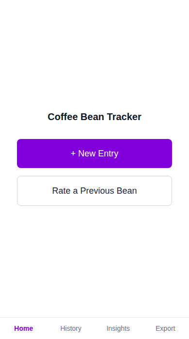

# Coffee Bean Tracker

A self-hosted web app for logging and rating coffee, whether it's a bag you
bought or a one-off cup from a cafe. Photos of bag labels or menu boards get
read automatically in the background to fill in details like origin, process,
and roast level, so logging something takes seconds. Over time it builds up
data on what you actually like.



## AI disclosure

This project was built using Claude (Anthropic) as an AI coding assistant.
The author designed the data model, workflow, and feature scope; Claude wrote
most of the implementation.

## Status

Pre-release, actively being built. See the roadmap below for what's done and
what's next.

## Prerequisites

- Docker and Docker Compose installed on the host you're deploying to
- An Anthropic API key (only needed once photo extraction is enabled, from
  milestone 0.2.0 onward) from [console.anthropic.com](https://console.anthropic.com)

## Quick start

```
git clone https://github.com/help-for-me/Coffee-Bean-Tracker
cd Coffee-Bean-Tracker
cp .env.example .env
docker compose up -d
```

## Configuration

All settings are set via the `.env` file. Copy `.env.example` to `.env` and
adjust as needed.

| Variable | Description | Default |
|---|---|---|
| `EXTRACTOR_PROVIDER` | Which vision extractor fills in bag details from photos. `claude` for now; `ollama` arrives in milestone 1.6.0. | `claude` |
| `CLAUDE_MODEL` | Claude model used for photo extraction. | `claude-haiku-4-5-20251001` |
| `ANTHROPIC_API_KEY` | Your Anthropic API key. Only used for photo extraction. | none |
| `APP_PORT` | Port the app listens on. | `8000` |
| `PHOTOS_PATH` | Where uploaded photos are stored inside the container. | `/app/data/photos` |
| `RECENT_WINDOW_MONTHS` | How many months count as "recent" for insights. | `4` |
| `RECENT_WINDOW_COUNT` | How many entries count as "recent" for insights. | `10` |

A few more variables (for the local XLSX and GitHub backup exports) are
reserved for milestone 1.3.0 and aren't used yet. They're listed, commented
out, in `.env.example`.

## Deployment note

This app is meant to run on your own network only. It never needs an open
inbound port; it only reaches out to Claude's API for photo extraction. Bind
its port to your LAN and don't forward it through your router or firewall.

## Roadmap

- [x] 0.1.0 - Foundation (schema, manual entry)
- [ ] 0.2.0 - AI/OCR extraction loop
- [ ] 0.3.0 - Insights (stats and charts)
- [ ] 0.4.0 - Real usage and deployment (Docker, GHCR, self-hosted Unraid template)
- [ ] 1.0.0 - Stable
- [ ] 1.1.0 - Fixing wrong data
- [ ] 1.2.0 - Fuzzy repurchase matching
- [ ] 1.3.0 - Data backup sinks
- [ ] 1.4.0 - AI narrative insights
- [ ] 1.5.0 - Richer browsing (filters, attribute switcher)
- [ ] 1.6.0 - Ollama provider
- [ ] 1.7.0 - Settings UI
- [ ] 1.8.0 - Multi-user/auth
- [ ] 1.9.0 - Visual design pass
- [ ] 1.10.0 - Data export/import (JSON round-trip backup, for restoring or moving to a new install)
- [ ] 2.0.0 - Blank slate

The 1.10.0 backup format is JSON, not CSV/XLSX. An entry can have several
ratings, and that one-to-many relationship doesn't flatten into rows and
columns without ambiguity - JSON keeps the structure exact so a restore is
reliable. CSV (MVP) and XLSX (1.3.0) stay as human-readable reports for
opening in a spreadsheet, not as a re-import source.

## Future ideas (not version-gated)

Things worth doing eventually but not scoped or scheduled yet, since they
depend on outside community processes rather than just building the app:

- **Unraid Community Applications listing.** The self-hosted Unraid template
  (0.4.0) covers "click Update" for personal use. Submitting it to the public
  CA feed so anyone can find and install it is a bigger, separate step (PR
  review, ongoing support expectations) - a someday goal, not required for
  this app to work well on Unraid.
- **Proxmox VE Helper-Scripts.** The app already runs on Proxmox today via
  plain Docker Compose (see the Deployment note above) - no extra work
  needed for that. Adding a one-command install script to the community
  Helper-Scripts project is a nicer on-ramp for other Proxmox users, but
  it's a separate community submission, not a blocker for personal use.

## License

MIT, see [LICENSE](LICENSE).
